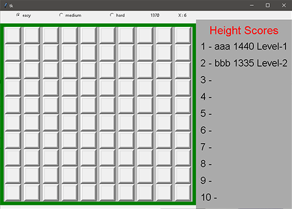
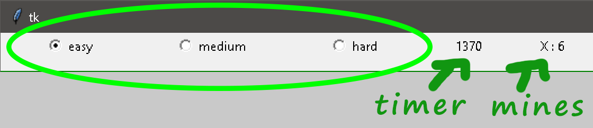
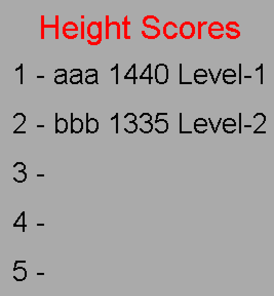

# Minesweeper

#### Video Demo:  https://www.youtube.com/watch?v=iBHT2sSUNcw

Note:

 😊 I'am not a graphics designer,and i am the worst
.
#### Description:
This game is the reason why i start programming when i was a kid.

CS50 introduced me to **Python** so i took the opportunity to start exploring python and do something with it.

Minesweeper is a single-player puzzle game. The objective of the game is to clear a rectangular board containing hidden "mines" or bombs without detonating any of them, with help from clues about the number of neighboring mines in each field.

You can start first by selecting the difficulty level

notice also the countdown timer which determines your score, and the number of mines in the game.

Because of my poor design i decided to have an old school scoreboard with a three letters name.

enjoy :)